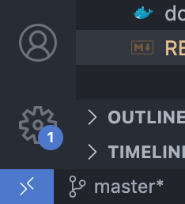
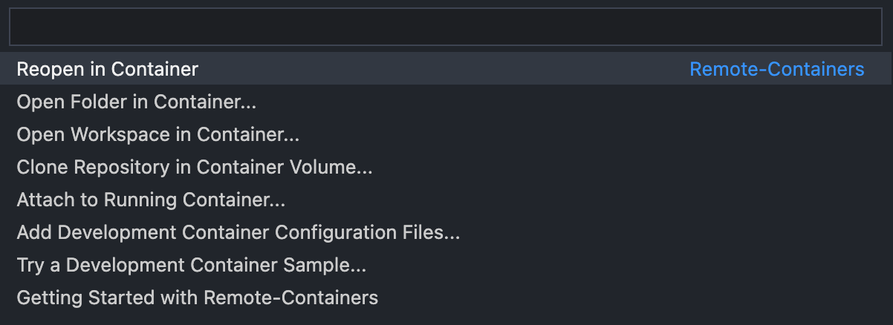
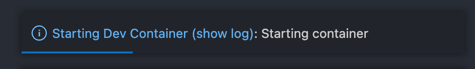
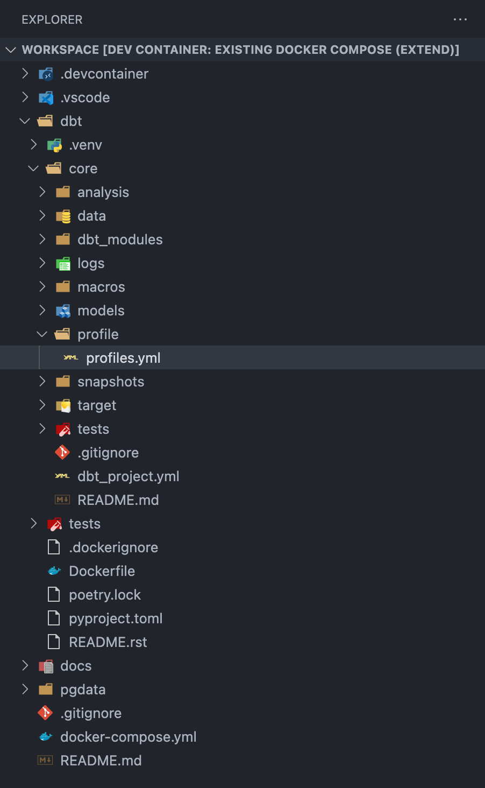

<div>

<h2>dbt proof-of-concept</h2>
</div>

## Prerequisite
- Python ^3.8
- Docker 
- Docker Compose
- (optional) [Remote Container Vscode extension](https://marketplace.visualstudio.com/items?itemName=ms-vscode-remote.remote-containers)

### devcontainer로 개발 환경 세팅하기
1. 레포 클론하기
    ```shell
    git clone https://github.com/ahnsv/dbt-proof-of-concept.git
    ```
2. devcontainer로 작업 환경 열기

    

    Remote Container 플러그인을 깔면, VSCode 왼쪽 하단에 버튼이 생긴다. 
    이 버튼을 누르면, 

    

    위와 같은 패널이 열리는데, `Reopen in Container` 액션을 선택한다. (devcontainer 관련 설정은 `.devcontainer` 폴더에서 확인할 수 있다.) 

    
    Devcontainer를 통해서 docker 및 docker-compose 환경 **안에서** VScode를 실행할 수 있다. Devcontainer에 대해서 더 알아보고 싶다면, Vscode 공식문서 [Developing inside a Container](https://code.visualstudio.com/docs/remote/containers)를 참고.

    

3. dbt 실행하기
    devcontainer가 정상적으로 실행됐으면, 모든 필요한 의존성이 설치되어있는 상태일 것이다. 


    ```shell
    # dbt 프로젝트 디렉토리 접근
    cd dbt

    # 모델 컴파일
    dbt compile --profiles-dir profile --project-dir core

    # 모델 실행
    dbt run [--models <(+)model_name(+)>] --profiles-dir profile --project-dir core 

    # 테스트 실행
    dbt test [--models <(+)model_name(+)>] --profiles-dir profile --project-dir core
    ```

    원래 dbt의 기본 설정에는 $HOME 디렉토리에 `profiles.yml` 설정파일을 만들지만, 협업 가능한 환경을 만들기 위해 프로젝트 안에 profile 디렉토리를 만들었고, dbt cli가 profile 디렉토리를 찾기 위해 `--profiles-dir`플래그로 해당 폴더를 가리키게 한다.

    마찬가지로 dbt 이외의 다른 python package들을 격리된 환경에서 실행할 수 있게 만들기 위해서 core라는 모듈 안에 dbt init을 했다. 때문에 `--project-dir`로 core를 바라보게 해줘야한다. 

4. devcontainer 끄기
    작업을 모두 마치고 devcontainer 환경을 끄려면 왼쪽 하단 버튼을 눌러서 (또는 cmd+shift+p) `Reopen Folder Locally`를 선택한다. 